<div align="center">


<br/>

<!-- ⌚ OMNITRIX TRANSFORMATION DIAL — custom SVG animation -->


> *"No matter what, I never give up. That's just what heroes do."* — **Ben Tennyson**

<br/>


<br/>

[](https://github.com/alokkumardalei-wq)
[](https://github.com/alokkumardalei-wq)

</div>

---

<div align="center">

## ⌚ Omnitrix Scan — About Me

</div>


I'm a passionate student developer who transforms problems into solutions — just like Ben transforms with the Omnitrix. I've got **10 alien forms** of tech skills and an **infinite playlist** of curiosity. Always evolving, always going **Ultimate**.

🎓 **School:** Vedam School Of Technology
🌱 **Alien DNA:** Python, Golang, Software Architecture
💚 **Domain:** Web Development, Backend Systems, Problem Solving
🎯 **Mission:** Build impactful projects & Master DSA
⌚ **Ability:** *Omnitrix* — Transform any problem into a solution

<br clear="right"/>

---

## 🤝 Plumber Signal — Let's Connect

<div align="center">

*"Being a hero isn't about the power you have — it's about what you do with it."*

<br/>

<a href="https://github.com/alokkumardalei-wq">
  
</a>
&nbsp;
<a href="https://www.linkedin.com/in/alok-kumar-dalei/">
  
</a>
&nbsp;
<a href="https://x.com/dalei5383">
  
</a>
&nbsp;
<a href="mailto:alokkumardalei2@gmail.com">
  
</a>

</div>

---

## 🔥 Alien Roster — Active Transformations

<div align="center">

| Alien | Power | Tech Equivalent |
|-------|-------|-----------------|
| 🔥 **Heatblast** | Fire & Heat Manipulation | Ignites every new project from scratch |
| ⚡ **XLR8** | Superhuman Speed | Blazing fast Python & Go development |
| 💪 **Four Arms** | Immense Strength | Raw power in HTML, CSS, JS, Java |
| 🔧 **Upgrade** | Technology Merging | Adapts to any tool or tech stack |
| 💎 **Diamondhead** | Crystal Projection | Unbreakable clean architecture |
| 🧠 **Grey Matter** | Super Intelligence | Algorithm design & problem solving |

<br/>

<!-- 🔥 HEATBLAST THROWING FIREBALL — custom SVG animation -->


<br/>

<!-- ⚡ XLR8 SPEED DASH — custom SVG animation -->


</div>

---

## 🔴 Omnitrix DNA — Tech Arsenal

<div align="center">

### 💪 Four Arms — Core Strength


### ⚡ XLR8 — Speed Learning


### 🔧 Upgrade — Tools & Platforms


</div>

---

## 🟢 Omnitrix Interface — Developer Profile

```javascript
// ⌚ OMNITRIX ACTIVATED — IT'S HERO TIME! ⌚
const alok = {
    title: "The Ultimate Developer 🔴",
    school: "Vedam School Of Technology",
    
    // 10 Alien forms of tech
    alienDNA: ["Python", "Golang", "Software Architecture"],
    
    // Active transformation
    domain: ["Web Development", "Backend Systems", "Problem Solving"],
    
    // Hero's pledge
    herosPledge: [
        "Build impactful projects 🌀",
        "Contribute to open source 💚",
        "Master DSA ⌚"
    ],
    
    secretWeapon: "I debug at the speed of XLR8 🚀",
    
    // Ben's Alien Roster mapped to skills
    alienRoster: {
        heatblast:    "🔥 Ignites every new project — scorches every bug",
        xlr8:         "⚡ Blazing fast with Python & Go",
        fourArms:     "💪 Raw coding strength — HTML/CSS/JS/Java",
        upgrade:      "🔧 Merges with any tech stack",
        diamondhead:  "💎 Crystal-clear, unbreakable architecture",
        greyMatter:   "🧠 DSA & Algorithm mastery",
    },

    status: "Omnitrix Unlocked 🔓 | Going Ultimate 🔥"
};
```

---

## 📊 Omnitrix Power Stats — GitHub

<div align="center">


<br/><br/>


</div>

---

## 👻 Ghostfreak Haunts the Heatmap — Activity

<div align="center">

<!-- 👻 GHOSTFREAK FLOATING — custom SVG animation -->


*👻 "Your activity graph belongs to me now." — Ghostfreak, probably 👻*

</div>

---

## 💭 Ben's Dev Wisdom

<div align="center">


<br/>

> *"It's Hero Time."* — on every `git push`, always ⌚

</div>

---

<div align="center">

### ⌚ Visitor Count — Omnitrix Tracking


<br/>


**💚 The Ultimate Dev — Unlocked and Unstoppable 💚**

</div>
